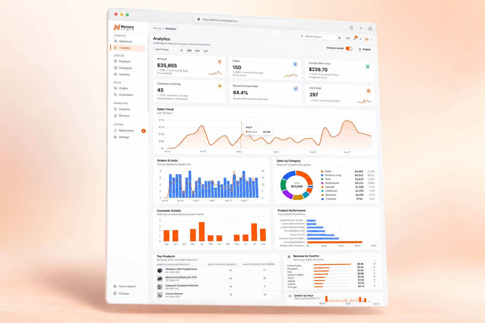
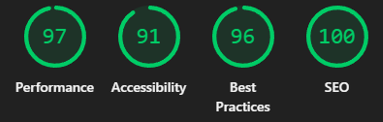

<div align="center">

#  Nexora Admin

### داشبورد مدیریت پیشرفته و حرفه‌ای فروشگاه اینترنتی

[**🌐 مشاهده دمو زنده (Vercel)**](https://nexora-admin-app.vercel.app/)
<br />


  <br />



</div>

---

## 📌 معرفی پروژه

**Nexora Admin**
یک پنل مدیریت (Admin Dashboard) کامل، پرسرعت، مدرن و حرفه‌ای برای فروشگاه‌های اینترنتی است که با استفاده از آخرین فریم‌ورک‌ها و تکنولوژی‌های وب شامل **Next.js 16 (App Router)**، **React 19**، **Supabase (PostgreSQL + Auth + Storage)** و **Tailwind CSS v4** طراحی و پیاده‌سازی شده است.

این پروژه تمامی بخش‌های کلیدی یک فروشگاه اینترنتی واقعی را پوشش می‌دهد: مدیریت کاتالوگ محصولات، دسته‌بندی‌ها، انبارداری، سفارشات، مشتریان، کدهای تخفیف، نظرات خریداران، گزارش‌های مالی و تحلیلی.

---

## 🌟 ویژگی‌ها و نقاط قوت کلیدی

### ⚡ کارایی و سرعت فوق‌العاده (Lighthouse 97/100)

- **ارزیابی درخشان لایت‌هاوس:** کسب نمره **۹۷/۱۰۰ در Performance**، **۱۰۰/۱۰۰ در SEO**، **۹۶/۱۰۰ در Best Practices** و **۹۱/۱۰۰ در Accessibility**.
- **فونت‌های اختصاصی بدون بلاک رندر:** استفاده از `next/font/google` برای بارگذاری بهینه فونت‌های Vazirmatn و Inter به صورت محلی.
- **بارگذاری تنبل چارت‌ها (Lazy Loading):** استفاده از `next/dynamic` برای کدهای سنگین Recharts تا زمان پاسخگویی اولیه (LCP & TBT) به حداقل برسد.
- **بهینه‌سازی مدرن تصاویر:** استفاده از کامپوننت `next/image` با فرمت‌های AVIF/WebP و تولید خودکار `srcset` متناسب با سایز نمایشگر.

<br />

<div align="center">
  
</div>

<br />

### 🌐 دو زبانه و RTL کامل (Persian & English)

- **پشتیبانی کامل از زبان فارسی و انگلیسی:** با قابلیت سوئیچ لحظه‌ای زبان بدون نیاز به رفرش کامل صفحه.
- **راست‌چین (RTL) و چپ‌چین (LTR) هوشمند:** تغییر خودکار جهت سند (`dir="rtl"` / `dir="ltr"`)، فونت‌ها، چیدمان آیکون‌ها و انیمیشن‌های سایدبار موبایل.
- **فرمت‌کننده هوشمند قیمت و اعداد:** نمایش تمیز قیمت‌ها بدون اعشار صفر زاید در فارسی (مثلاً `$۵۹` به‌جای `$۵۹٫۰۰` که با هزارگان اشتباه نشود).

### 🔒 امنیت و احراز هویت سرور-ساید (Server-Side Auth & Middleware)

- **محافظت از مسیرها در سطح سرور (`middleware.js`):** بررسی نشست کاربر از طریق کوکی‌های امن با استفاده از `@supabase/ssr` پیش از رندر صفحات (جلوگیری ۱۰۰٪ از مشاهده محتوای ادمین توسط افراد واردنشده).
- **قوانین دسترسی دیتابیس (Row Level Security - RLS):** ایمن‌سازی تمام جداول در Supabase طوری که فقط کاربران احراز هویت شده به داده‌ها دسترسی داشته باشند.
- **قفل محافظت از حساب دمو:** جلوگیری از تغییر ایمیل یا رمز عبور اکانت عمومی دمو توسط بازدیدکنندگان برای حفظ پایداری سیستم.

### 📦 دیتابیس ابری و مدیریت فایل Supabase

- **PostgreSQL ابری:** اتصال مستقیم به Supabase با بیش از ۷۵ محصول واقعی، ۱۵۰ سفارش، ۱۲۸ نظر و ۸۰ مشتری.
- **ذخیره‌سازی تصاویر در Supabase Storage:** باکت عمومی `product-images` برای آپلود و میزبانی مستقیم عکس‌های محصولات.

### 📊 داشبورد تحلیلی و چارت‌های زنده

- **نمودارهای درآمد و فروش:** چارت‌های تعاملی Area و Line با امکان تغییر بازه زمانی (۷ روزه، ۳۰ روزه، ۹۰ روزه، ۱۲ ماهه).
- **سیستم لنگرگاهی تاریخ (Rolling Anchor):** الگوریتم هوشمند در `sbApi.js` که با گذشت زمان، تاریخ سفارش‌ها را خودکار به «امروز» منتقل می‌کند تا نمودارها هیچ‌گاه خط صاف نشوند.

### 📐 طراحی کاملاً پاسخ‌گو (Mobile First Responsive)

- **بدون اسکرول افقی در موبایل:** طراحی جداول محصولات، دسته‌ها، نظرات و کوپن‌ها به گونه‌ای که تمام ستون‌های فرعی در موبایل مخفی شده و صفحه هرگز اسکرول افقی نخورد.
- **مودال‌های پاسخ‌گو:** تنظیم ارتفاع استاندارد و اسکرول داخلی مودال‌ها جهت نمایش صحیح در صفحه‌نمایش‌های کوچک.

### 🎭 مجموعه تست‌های اتوماتیک E2E با Playwright

- **دارای ۴۶ تست مرورگر اتوماتیک:** تست جامع سناریوهای لاگین، خروج، محافظت از مسیرها، بارگذاری ۱۳ صفحه، فرمت قیمت‌ها و ریسپانسو بودن در دسکتاپ و موبایل.

---

## 🛠️ تکنولوژی‌های استفاده‌شده (Tech Stack)

| بخش                | تکنولوژی / کتابخانه       | توضیحات                                                     |
| ------------------ | ------------------------- | ----------------------------------------------------------- |
| **فریم‌ورک اصلی**  | Next.js 16.3 (App Router) | رندرینگ مدرن، Server Components (RSC)، سیستم routing جدید   |
| **کتابخانه UI**    | React 19                  | جدیدترین نسخه ری‌اکت با پشتیبانی کامل از RSC                |
| **دیتابیس و Auth** | Supabase (@supabase/ssr)  | PostgreSQL ابری، Authentication با کوکی، Storage عمومی      |
| **استایل‌دهی**     | Tailwind CSS v4           | فریم‌ورک استایل‌دهی توکار با متغیرهای اختصاصی تم تاریک/روشن |
| **مدیریت استیت**   | Redux Toolkit v2          | مدیریت استیت‌های کلاینت (تم، زبان، اعلان‌ها، کاربر)         |
| **نمودارها**       | Recharts                  | چارت‌های تعاملی و بهینه‌شده                                 |
| **اسلایدر گالری**  | Swiper 14                 | اسلایدر عکس محصولات با پشتیبانی از دکمه‌های RTL             |
| **تست اتوماتیک**   | Playwright E2E            | تست اتوماتیک مرورگر در نمایشگرهای مختلف                     |

---

## 🔑 مشخصات ورود به حساب دمو (Demo Credentials)

برای تست و بررسی پروژه می‌توانید از مشخصات زیر در صفحه `/login` استفاده کنید (اطلاعات به صورت خودکار در فرم قرار دارند):

- **ایمیل:** `amir.rezazadeh@nexora.com`
- **رمز عبور:** `nexora2026`

---

## 💻 راهنمای نصب و اجرای لوکال

### پیش‌نیازها

- **Node.js 18.17+** (پیشنهاد می‌شود Node.js 20 یا 22)
- **npm** یا **pnpm**

### ۱. کلون کردن پروژه و نصب وابستگی‌ها

```bash
git clone https://github.com/your-username/nexora-admin.git
cd nexora-admin
npm install
```

### ۲. تنظیم متغیرهای محیطی (`.env.local`)

یک فایل به نام `.env.local` در ریشه پروژه بسازید و متغیرهای Supabase خود را قرار دهید:

```env
NEXT_PUBLIC_SUPABASE_URL=https://akqrnvrgsnofnhrhlxow.supabase.co
NEXT_PUBLIC_SUPABASE_ANON_KEY=sb_publishable_aNo4PzSif8eS7OKLwv6Z4g_dfBBCXxG
```

### ۳. اجرای محیط توسعه (Development)

در سیستم‌عامل ویندوز برای اجرا با موتور Webpack دستور زیر را بزنید:

```bash
npm run dev
```

برنامه در آدرس `http://localhost:3000` در دسترس خواهد بود.

### ۴. ساخت بیلد پروداکشن (Production Build)

```bash
npm run build
npm run start
```

### ۵. اجرای تست‌های اتوماتیک Playwright

```bash
# اجرای تمام ۴۶ تست در حالت headless
npm run test:e2e

# اجرای تست‌ها با رابط کاربری تعاملی
npx playwright test --ui

# دیدن گزارش HTML تست‌ها
npx playwright show-report
```

---

## 📂 ساختار پوشه‌های پروژه

```text
nexora-admin/
├── public/                # فایل‌های ایستا، آیکون‌ها و لوگوهای برند
│   └── brand/             # تصاویر برند و پیش‌نمایش دمو (nexora-demo.png)
├── src/
│   ├── app/               # صفحات و مسیرهای Next.js App Router (RSC & Client Pages)
│   │   ├── (auth)/        # login, forgot-password, reset-password
│   │   ├── products/      # لیست محصولات، جزئیات (/products/[id])، افزودن و ویرایش
│   │   ├── orders/        # سفارشات و جزئیات سفارش (/orders/[id])
│   │   ├── customers/     # مشتریان و پروفایل خریدار (/customers/[id])
│   │   ├── categories/    # دسته‌بندی‌ها
│   │   ├── analytics/     # گزارش‌ها و تحلیل‌های مالی
│   │   └── settings/      # تنظیمات فروشگاه، پرداخت، ارسال، امنیت و ظاهری
│   ├── components/        # کامپوننت‌های reusable
│   │   ├── ui/            # Button, Input, Modal, Table, Badge, Card, StatCard, ...
│   │   ├── charts/        # RevenueChart, SalesChart, CategoryChart, ...
│   │   └── layout/        # AppShell, Header, Sidebar, SettingsLayout, Toaster
│   ├── i18n/              # دیکشنری‌های ترجمه فارسی/انگلیسی (messages.js, extra.js, server.js)
│   ├── lib/               # توابع کمکی، supabaseClient, supabaseServer, sbApi, format
│   └── store/             # اسلایس‌های Redux Toolkit (auth, ui, theme, notifications)
├── tests/                 # تست‌های اتوماتیک E2E با Playwright
│   ├── auth.spec.js
│   ├── navigation.spec.js
│   ├── products.spec.js
│   └── responsive.spec.js
├── middleware.js          # احراز هویت سرور-ساید با کوکی‌ها (@supabase/ssr)
├── playwright.config.js   # کانفیگ Playwright
└── next.config.js         # کانفیگ بهینه‌سازی Next.js
```

---

## 👨‍💻 توسعه‌دهنده

طراحی و توسعه‌یافته توسط **امیر رضازاده**  
پروژه پورتفولیو و نمونه‌کار سطح بالا برای ارزیابی مهارت‌های فرانت‌اند و فول‌استک با Next.js و Supabase.

---

<div align="center">
  <sub>Nexora Admin — Built with precision, performance, and attention to detail.</sub>
</div>
